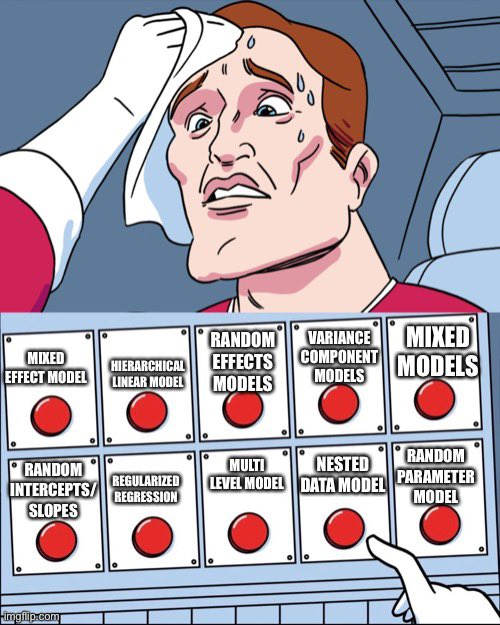

<!-- README.md is generated from README.Rmd. Please edit that file -->

# multilevelmod

<!-- badges: start -->

[](https://lifecycle.r-lib.org/articles/stages.html)
[](https://app.codecov.io/gh/topepo/multilevelmod?branch=main)
[](https://github.com/tidymodels/multilevelmod/actions/workflows/R-CMD-check.yaml)
<!-- badges: end -->

multilevelmod enables the use of multi-level models (a.k.a mixed-effects
models, Bayesian hierarchical models, etc.) with the parsnip package.

<a href="https://pbs.twimg.com/media/FD1_OIhVIAE4H5l?format=jpg&name=small"></a>

(meme courtesy of
[`@ChelseaParlett`](https://twitter.com/ChelseaParlett))

## Installation

You can install the released version of multilevelmod from
[CRAN](https://cran.r-project.org) with:

``` r
install.packages("multilevelmod")
```

For the development version:

``` r
devtools::install_github("tidymodels/multilevelmod")
```

## Available Engines

The multilevelmod package provides engines for the models in the
following table.

| model        | engine     | mode           |
|:-------------|:-----------|:---------------|
| linear_reg   | stan_glmer | regression     |
| linear_reg   | lmer       | regression     |
| linear_reg   | gee        | regression     |
| linear_reg   | lme        | regression     |
| linear_reg   | gls        | regression     |
| logistic_reg | gee        | classification |
| logistic_reg | glmer      | classification |
| logistic_reg | stan_glmer | classification |
| poisson_reg  | gee        | regression     |
| poisson_reg  | glmer      | regression     |
| poisson_reg  | stan_glmer | regression     |

## Example

Loading mixedlevelmod will trigger it to add a few modeling *engines* to
the parsnip model database. For Bayesian models, there are now
`stan-glmer` engines for `linear_reg()`, `logistic_reg()`, and
`poisson_reg()`.

To use these, the function `parsnip::fit()` function should be used
instead of `parsnip::fit_xy()` so that the model terms can be specified
using the `lme`/`lme4` syntax.

The `sleepstudy` data is used as an example:

``` r
library(multilevelmod)
set.seed(1234)
data(sleepstudy, package = "lme4")

mixed_model_spec <- linear_reg() %>% set_engine("lmer")

mixed_model_fit <- 
  mixed_model_spec %>% 
  fit(Reaction ~ Days + (Days | Subject), data = sleepstudy)

mixed_model_fit
#> parsnip model object
#> 
#> Linear mixed model fit by REML ['lmerMod']
#> Formula: Reaction ~ Days + (Days | Subject)
#>    Data: data
#> REML criterion at convergence: 1743.628
#> Random effects:
#>  Groups   Name        Std.Dev. Corr
#>  Subject  (Intercept) 24.741       
#>           Days         5.922   0.07
#>  Residual             25.592       
#> Number of obs: 180, groups:  Subject, 18
#> Fixed Effects:
#> (Intercept)         Days  
#>      251.41        10.47
```

For a Bayesian model:

``` r
hier_model_spec <- linear_reg() %>% set_engine("stan_glmer")

hier_model_fit <- 
  hier_model_spec %>% 
  fit(Reaction ~ Days + (Days | Subject), data = sleepstudy)

hier_model_fit
#> parsnip model object
#> 
#> stan_glmer
#>  family:       gaussian [identity]
#>  formula:      Reaction ~ Days + (Days | Subject)
#>  observations: 180
#> ------
#>             Median MAD_SD
#> (Intercept) 251.3    6.5 
#> Days         10.5    1.7 
#> 
#> Auxiliary parameter(s):
#>       Median MAD_SD
#> sigma 25.9    1.6  
#> 
#> Error terms:
#>  Groups   Name        Std.Dev. Corr
#>  Subject  (Intercept) 24.1         
#>           Days         6.9     0.09
#>  Residual             26.0         
#> Num. levels: Subject 18 
#> 
#> ------
#> * For help interpreting the printed output see ?print.stanreg
#> * For info on the priors used see ?prior_summary.stanreg
```

## Contributing

This project is released with a [Contributor Code of
Conduct](https://www.contributor-covenant.org/version/2/0/CODE_OF_CONDUCT.html).
By contributing to this project, you agree to abide by its terms.

-   For questions and discussions about tidymodels packages, modeling,
    and machine learning, please [post on RStudio
    Community](https://community.rstudio.com/new-topic?category_id=15&tags=tidymodels,question).

-   If you think you have encountered a bug, please [submit an
    issue](https://github.com/tidymodels/multilevelmod/issues).

-   Either way, learn how to create and share a
    [reprex](https://community.rstudio.com/new-topic?category_id=15&tags=tidymodels,question)
    (a minimal, reproducible example), to clearly communicate about your
    code.

-   Check out further details on [contributing guidelines for tidymodels
    packages](https://www.tidymodels.org/contribute/) and [how to get
    help](https://www.tidymodels.org/help/).
